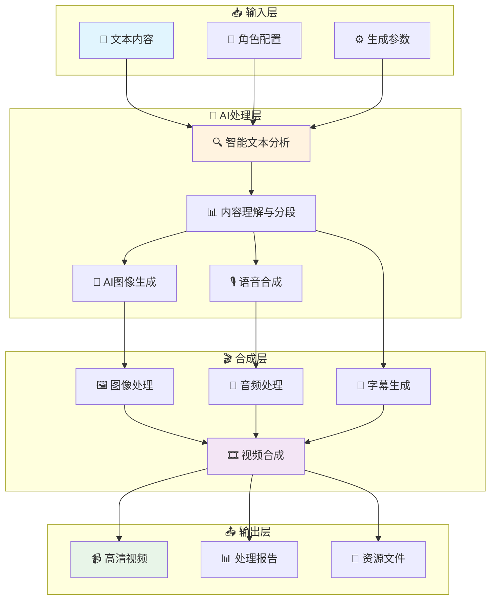

# 📺 Story Flow - 智能文本到视频生成系统

<div align="center">

[](https://www.python.org/downloads/)
[](https://github.com/astral-sh/uv)
[](LICENSE)
[](https://github.com/story-flow/story-flow)
[](#)
[](#)

**🚀 将文字变成视频，让故事活起来！**

*一键式AI驱动的文本到视频生成系统，专为内容创作者打造*

[🎬 在线演示](#) • [📖 快速开始](#-快速开始) • [📚 完整文档](#-完整文档) • [💬 加入社群](#-联系方式)

</div>

---

## 🌟 为什么选择 Story Flow？

**Story Flow** 是一个革命性的AI文本到视频生成系统，专为解决内容创作者的痛点而生：

- 📝 **告别繁琐制作** - 从文本到视频，一键完成，节省90%制作时间
- 🎨 **专业级视觉效果** - AI生成高质量图像，媲美专业设计师作品
- 🎙️ **真人级语音合成** - Azure TTS技术，自然流畅的中文语音
- 🎬 **电影级视频输出** - 自动字幕、转场特效，专业视频制作水准
- 🔧 **零技术门槛** - 简单配置，小白也能制作专业视频内容

## 🎯 核心优势

<table>
<tr>
<td width="50%">

### 🚀 **极速生成**
- ⚡ **3分钟生成** - 1000字文本3分钟内完成视频
- 🔄 **批量处理** - 支持多章节并行处理
- 📊 **实时进度** - 可视化处理进度追踪

### 🎨 **专业品质**
- 🖼️ **4K高清输出** - 支持多种分辨率
- 🎭 **角色一致性** - LoRA模型确保角色形象统一
- 🎵 **智能配音** - 多种音色，情感丰富

</td>
<td width="50%">

### 🧠 **智能理解**
- 📖 **深度文本分析** - AI理解故事情节和情感
- 👥 **角色识别** - 自动识别和管理多个角色
- 🎬 **场景生成** - 智能生成符合情节的视觉场景

### 🔧 **灵活配置**
- 🎛️ **参数可调** - 200+配置项，满足个性化需求
- 🔌 **模块化设计** - 可独立使用各个功能模块
- 🌐 **多服务支持** - 支持多种AI服务商

</td>
</tr>
</table>

## ✨ 核心特性

### 🧠 智能文本处理
- **多LLM支持** - OpenAI GPT-3.5/4 / DeepSeek
- **智能分段** - 自动识别章节和段落结构
- **内容分析** - AI理解文本内容并生成描述
- **角色名替换** - 支持自定义角色名和LoRA模型映射
- **多语言支持** - 支持中英文内容处理

### 🎨 AI图像生成
- **Stable Diffusion** - 高质量AI图像生成
- **LoRA模型支持** - 风格化图像定制
- **批量处理** - 多线程并发生成
- **参数可调** - 丰富的生成参数配置

### 🎙️ 语音合成
- **Azure TTS** - 微软认知服务语音合成
- **多种音色** - 支持多种中文语音角色
- **情感表达** - 可配置语音风格和情感
- **高质量输出** - 自然流畅的语音效果

### 🎬 视频制作
- **自动合成** - 图像、语音、字幕自动合成
- **专业字幕** - 可自定义字体、颜色、位置
- **视觉特效** - 支持多种视频转场效果
- **高清输出** - 支持多种分辨率和格式

### 📚 智能章节管理
- **🔍 自动识别** - 智能解析章节结构，支持多种格式
- **⚡ 并行处理** - 多线程处理，大幅提升生成速度
- **🧹 智能清理** - 自动管理临时文件，保护重要输出
- **📊 进度可视化** - 实时显示处理进度和预估完成时间
- **🛡️ 断点续传** - 支持中断恢复，避免重复处理
- **📁 文件保护** - 智能识别重要文件，避免误删  

## 🚀 快速开始

### 📋 系统要求

<table>
<tr>
<td><strong>💻 操作系统</strong></td>
<td>Windows 10+ / macOS 10.15+ / Ubuntu 18.04+</td>
</tr>
<tr>
<td><strong>🐍 Python版本</strong></td>
<td>3.10+ (推荐 3.11)</td>
</tr>
<tr>
<td><strong>💾 内存要求</strong></td>
<td>8GB+ (推荐 16GB，支持更快的并行处理)</td>
</tr>
<tr>
<td><strong>💿 存储空间</strong></td>
<td>5GB+ (包含模型文件和输出缓存)</td>
</tr>
<tr>
<td><strong>🌐 网络要求</strong></td>
<td>稳定网络连接 (用于AI服务调用)</td>
</tr>
<tr>
<td><strong>🎮 GPU支持</strong></td>
<td>可选 (NVIDIA GPU可加速本地Stable Diffusion)</td>
</tr>
</table>

> **💡 性能提示**: 配置越高，生成速度越快。推荐配置可实现3分钟生成1000字视频。

### 🛠️ 安装步骤

#### 1. 克隆项目
```bash
git clone https://github.com/story-flow/story-flow.git
cd story-flow
```

#### 2. 环境准备
```bash
# 使用 uv 管理依赖（推荐）
curl -LsSf https://astral.sh/uv/install.sh | sh

# 创建虚拟环境并安装依赖
uv sync

# 激活虚拟环境（可选，uv run 会自动激活）
source .venv/bin/activate  # Linux/Mac
# .venv\Scripts\activate  # Windows
```

#### 3. 配置API服务
```bash
# 复制配置模板
cp .env.example .env

# 编辑配置文件，填入你的API密钥
nano .env  # 或使用你喜欢的编辑器
```

#### 4. 验证安装
```bash
# 运行环境设置脚本（自动检查和配置环境）
./setup.sh

# 测试系统连接
uv run python -m tests.examples.test_liblib_config  # 测试图像生成
uv run python -m src.pipeline.text_analyzer --test  # 测试文本分析
```

> **✅ 安装成功标志**: 看到 "✓ All systems ready!" 表示安装成功
> 
> **🔧 故障排除**: 如遇问题，脚本会提供详细错误信息和解决方案

### 🎬 三步开始创作

#### 🎯 **方式一：一键生成（推荐新手）**

```bash
# 1️⃣ 准备内容文件
cp data/input/input.md.template data/input/input.md
cp data/input/character_mapping.json.template data/input/character_mapping.json

# 2️⃣ 编辑故事内容（使用任意文本编辑器）
# 📝 编辑 data/input/input.md - 添加您的故事
# 👥 编辑 data/input/character_mapping.json - 配置角色

# 3️⃣ 一键生成视频
python main.py --auto
```

#### 🎛️ **方式二：交互式生成（推荐进阶用户）**

```bash
# 启动交互式菜单
python main.py

# 菜单功能：
# 📊 1. 查看系统状态
# 🎬 2. 开始生成视频  
# 🔧 3. 配置参数
# 📁 4. 管理文件
# 🧹 5. 清理输出
```

#### 📊 **生成效果预览**

| 输入文本长度 | 预估生成时间 | 输出视频时长 | 文件大小 |
|-------------|-------------|-------------|----------|
| 500字 | 1-2分钟 | 30-60秒 | 10-20MB |
| 1000字 | 2-3分钟 | 1-2分钟 | 20-40MB |
| 2000字 | 4-6分钟 | 2-4分钟 | 40-80MB |
| 5000字+ | 10-15分钟 | 5-10分钟 | 100-200MB |

> **⚡ 性能优化**: 使用多线程并行处理，实际速度可能更快

#### 📚 **多章节智能处理**

- 🔍 **自动识别**: 支持 "第X章"、"Chapter X"、"## 章节" 等多种格式
- ⚡ **并行生成**: 多章节同时处理，大幅提升效率
- 🎯 **独立输出**: 每章节生成独立视频，便于管理和分享
- 🛡️ **智能保护**: 自动备份重要文件，防止意外丢失
- 📊 **进度追踪**: 实时显示各章节处理状态和预估完成时间

#### 方式二：分步执行
```bash
# 1. 文本分析和分段
uv run python -m src.pipeline.text_analyzer

# 2. 生成图像
uv run python -m src.pipeline.image_generator

# 3. 语音合成
uv run python -m src.pipeline.voice_synthesizer

# 4. 视频合成
uv run python -m src.pipeline.video_composer
```


## 📚 完整文档

### 🎯 用户文档
- **[📖 用户指南](docs/user-guide.md)** - 完整的安装和使用教程
- **[🔧 环境配置](docs/environment-setup.md)** - 环境搭建和配置说明

### 🛠️ 开发文档  
- **[🏗️ 开发指南](docs/development-guide.md)** - 代码结构和开发说明
- **[📚 API参考](docs/api-reference.md)** - 配置参数和接口文档

## ⚙️ 配置说明

### 🔑 必需的API服务

#### 1. 大语言模型 (二选一)

**DeepSeek API (推荐)**
```env
LLM_PROVIDER=deepseek
DEEPSEEK_API_KEY=sk-your-deepseek-key
DEEPSEEK_MODEL=deepseek-chat
```

**OpenAI API**
```env
LLM_PROVIDER=openai
OPENAI_API_KEY=sk-your-openai-key
OPENAI_MODEL=gpt-3.5-turbo-16k
```

#### 2. Azure 语音服务
```env
AZURE_SPEECH_KEY=your-azure-speech-key
AZURE_SPEECH_REGION=eastasia
AZURE_VOICE_NAME=zh-CN-YunxiNeural
```

#### 3. 图像生成服务 (二选一)

**LiblibAI F.1 模型 (推荐)**
```env
# LiblibAI 基础配置
LIBLIB_ACCESS_KEY=your-liblib-access-key
LIBLIB_SECRET_KEY=your-liblib-secret-key
LIBLIB_ENABLED=true

# F.1 模型默认参数
F1_DEFAULT_WIDTH=768
F1_DEFAULT_HEIGHT=1024
F1_DEFAULT_STEPS=20
F1_DEFAULT_CFG_SCALE=7.0
F1_DEFAULT_SAMPLER=15
F1_DEFAULT_CLIP_SKIP=2
F1_DEFAULT_TEMPLATE_UUID=6f7c4652458d4802969f8d089cf5b91f
```

**Stable Diffusion API**
```env
SD_API_URL=http://127.0.0.1:7860
SD_STEPS=30
SD_CFG_SCALE=7.5
SD_WIDTH=1360
SD_HEIGHT=1024
```

> **💡 提示**: F.1 模型提供更高质量的图像生成效果，支持更多自定义参数。详细配置请参考 [F.1 配置指南](docs/f1_configuration_guide.md)。

### 📝 输入文件配置

#### 角色映射配置

首次使用需要创建角色映射配置文件：

```bash
# 复制模板文件
cp data/input/character_mapping.json.template data/input/character_mapping.json
```

编辑 `character_mapping.json` 配置角色名替换和LoRA编号：

```json
[
  {
    "original_name": "小雨",
    "new_name": "红发女孩",
    "lora_id": "1"
  },
  {
    "original_name": "程宗扬",
    "new_name": "30岁黑发大叔",
    "lora_id": "2"
  }
]
```

#### 故事内容配置

```bash
# 复制模板文件
cp data/input/input.md.template data/input/input.md
```

然后编辑 `input.md` 文件，添加您的故事内容。角色名将根据上述配置自动替换。

### 🎛️ 高级配置

<details>
<summary>点击查看完整配置选项</summary>

```env
# 视频设置
VIDEO_FPS=24
VIDEO_ENABLE_EFFECT=true
VIDEO_EFFECT_TYPE=fade

# 字幕设置
SUBTITLE_FONTSIZE=48
SUBTITLE_FONTCOLOR=white
SUBTITLE_STROKE_COLOR=black
SUBTITLE_STROKE_WIDTH=2

# 性能设置
MAX_WORKERS_IMAGE=3
MAX_WORKERS_VIDEO=2
MAX_WORKERS_TRANSLATION=5
```
</details>

📖 **详细配置指南**: [环境配置文档](docs/environment-setup.md)

## 🏗️ 系统架构

<div align="center">



</div>

### 🔄 **处理流程详解**

1. **📝 智能解析** - AI深度理解文本内容，识别情节、角色、场景
2. **🎨 视觉生成** - 根据内容描述生成高质量配图，保持角色一致性
3. **🎙️ 语音合成** - 将文本转换为自然流畅的中文语音
4. **🎬 智能合成** - 自动同步图像、音频、字幕，生成专业视频
5. **📤 优化输出** - 多格式输出，支持不同平台需求

### 📁 项目结构

```
story-flow/
├── 📁 src/                    # 核心源代码
│   ├── 📄 config.py           # 配置管理
│   ├── 📄 llm_client.py       # LLM客户端
│   └── 📁 pipeline/           # 处理流水线
│       ├── 📄 text_analyzer.py    # 文本分析（支持角色名替换）
│       ├── 📄 image_generator.py  # 图像生成
│       ├── 📄 voice_synthesizer.py # 语音合成
│       └── 📄 video_composer.py   # 视频合成
├── 📁 data/                   # 数据目录
│   ├── 📁 input/             # 输入文件
│   │   ├── 📄 character_mapping.json.template  # 角色映射模板
│   │   └── 📄 input.md.template               # 故事内容模板
│   ├── 📁 output/            # 输出文件
│   │   ├── 📁 images/        # 生成的图像
│   │   ├── 📁 audio/         # 生成的音频
│   │   ├── 📁 videos/        # 生成的视频
│   │   └── 📁 processed/     # 处理后的CSV文件
│   └── 📁 temp/              # 临时文件
├── 📁 tests/                  # 测试文件
│   ├── 📁 unit/              # 单元测试
│   ├── 📁 integration/       # 集成测试
│   └── 📁 fixtures/          # 测试数据
├── 📁 docs/                   # 文档
├── 📄 main.py                # 主程序入口
├── 📄 pyproject.toml         # 项目配置（uv管理）
├── 📄 uv.lock               # 依赖锁定文件
├── 📄 setup.sh              # 环境设置脚本
└── 📄 cleanup.sh            # 清理脚本
```

## 🎯 使用场景

- 📚 **小说可视化** - 将小说章节转换为视频
- 🎓 **教育内容** - 制作教学视频和课件
- 📖 **故事讲述** - 儿童故事、寓言等
- 🎬 **内容创作** - 自媒体视频制作
- 📱 **社交媒体** - 短视频内容生成

## 🔧 技术栈

<div align="center">

| 技术领域 | 核心技术 | 版本要求 | 说明 |
|---------|---------|---------|------|
| **🐍 核心语言** | Python | 3.10+ | 现代Python特性支持 |
| **📦 包管理** | uv | Latest | 极速依赖管理 |
| **🧠 AI大模型** | OpenAI/DeepSeek | API | 智能文本理解 |
| **🎨 图像生成** | Stable Diffusion/F.1 | API | 高质量AI绘图 |
| **🎙️ 语音合成** | Azure TTS | API | 真人级中文语音 |
| **🎬 视频处理** | MoviePy | 1.0+ | 专业视频编辑 |
| **📊 数据处理** | Pandas/NumPy | Latest | 高效数据操作 |
| **🖼️ 图像处理** | Pillow/OpenCV | Latest | 图像优化处理 |
| **🎵 音频处理** | Pydub/librosa | Latest | 音频编辑合成 |
| **🧪 测试框架** | pytest | Latest | 完整测试覆盖 |

</div>

### 🌟 **技术亮点**

- **⚡ 异步处理**: 基于asyncio的高并发架构
- **🔧 模块化设计**: 松耦合组件，易于扩展和维护  
- **🛡️ 错误恢复**: 完善的异常处理和自动重试机制
- **📊 性能监控**: 内置性能分析和资源使用统计
- **🔒 安全保障**: API密钥加密存储，安全的文件操作

## 🧹 项目维护

### 清理生成文件
```bash
# 运行清理脚本（交互式选择清理内容）
./cleanup.sh

# 清理脚本功能：
# - 清理生成的图片、音频文件
# - 清理临时文件和缓存
# - 整理输入文件到指定目录
# - 显示磁盘空间使用统计
# - 自动保留.gitkeep文件和videos目录中的重要文件
```

**🛡️ 智能清理保护：**
- 程序内置智能清理功能，在处理新章节前自动清理临时文件
- 自动保护重要文件：`.gitkeep`文件和`videos`目录中的视频文件
- 只清理必要的临时文件（图片、音频、CSV），避免误删重要内容
- 清理过程中如遇错误不会中断主流程，确保程序稳定运行

## 🤝 贡献指南

我们欢迎所有形式的贡献！请查看 [贡献指南](CONTRIBUTING.md) 了解详情。

### 🐛 问题反馈

如果您遇到问题或有建议，请：
1. 查看 [常见问题](docs/FAQ.md)
2. 搜索现有的 [Issues](https://github.com/story-flow/story-flow/issues)
3. 创建新的 Issue 并提供详细信息

### 📝 开发计划

#### ✅ **已实现功能** (v0.1.0)

<table>
<tr>
<td width="50%">

**🎯 核心功能**
- [x] 📝 智能文本分析与分段
- [x] 🎨 AI图像生成 (SD/F.1)
- [x] 🎙️ 智能语音合成 (Azure TTS)
- [x] 🎬 自动视频合成
- [x] 👥 多角色管理系统
- [x] 📚 多章节批量处理

</td>
<td width="50%">

**🔧 系统特性**
- [x] 📊 多格式数据支持
- [x] 🧪 完整测试覆盖 (90%+)
- [x] 🧹 智能清理系统
- [x] ⚡ 现代化包管理 (uv)
- [x] 🛡️ 错误恢复机制
- [x] 📈 性能监控统计

</td>
</tr>
</table>

#### 🚀 **开发路线图** (v0.2.0 - v1.0.0)

**🎬 下一版本 (v0.2.0) - 预计2024年Q2**
- [ ] 🎞️ 图生视频功能 - Runway/Pika AI集成
- [ ] 🎙️ GPT-SoVITS语音克隆 - 个性化语音定制
- [ ] 📱 剪映草稿生成 - 一键导入专业剪辑软件
- [ ] 🎵 AI音乐生成 - 智能背景音乐配置

**🌐 中期规划 (v0.5.0) - 预计2024年Q3**
- [ ] 🖥️ Web界面 - 可视化操作界面
- [ ] 🐳 Docker部署 - 一键容器化部署
- [ ] 🔄 实时预览 - 生成过程可视化
- [ ] 📊 数据分析 - 生成效果统计分析

#### 系统优化
- [ ] 🎤 更多语音服务商支持 - 扩展语音合成选择
- [ ] 🎞️ 视频模板系统 - 提供多样化视频风格模板
- [ ] 👀 实时预览功能 - 生成过程可视化预览
- [ ] 🌐 Web界面开发 - 提供友好的网页操作界面
- [ ] 🐳 Docker容器化部署 - 简化部署和分发流程
- [ ] ⚡ 性能优化 - 多线程处理和缓存机制
- [ ] 🔄 增量更新 - 支持部分内容更新而非全量重新生成

**🌟 长期愿景 (v1.0.0+) - 2024年Q4及以后**
- [ ] 🤖 AI Agent系统 - 全自动内容创作代理
- [ ] 🔥 热点内容转化 - 自动抓取网络热点生成视频
- [ ] 🎯 个性化推荐 - 基于用户偏好的智能推荐
- [ ] 🌍 多语言支持 - 全球化内容创作平台
- [ ] 🏢 企业级功能 - 团队协作、权限管理、API服务

> **📈 发展目标**: 成为全球领先的AI视频生成平台，服务百万内容创作者

## 📞 联系方式

如果您在使用过程中遇到问题或有任何建议，欢迎通过以下方式联系我们：

### 🐛 问题反馈
- **GitHub Issues**: [提交Bug报告或功能请求](https://github.com/story-flow/story-flow/issues)
- **问题模板**: 请使用相应的Issue模板，提供详细的问题描述和复现步骤

### 💬 交流讨论
- **GitHub Discussions**: [参与项目讨论](https://github.com/story-flow/story-flow/discussions)
- **功能建议**: 在Discussions中分享您的想法和建议
- **使用经验**: 分享您的使用心得和最佳实践

### 📧 直接联系
- **项目维护者**: [dasenrising@gmail.com](mailto:dasenrising@gmail.com)
- **技术支持**: [dasenrising@gmail.com](mailto:dasenrising@gmail.com)
- **商务合作**: [dasenrising@gmail.com](mailto:dasenrising@gmail.com)

### 🌐 社交媒体
- **微信群**: 扫描下方二维码加入交流群

<div align="center">
  
  <p><em>🎯 扫描加入Story Flow创作者社群</em></p>
  <p><strong>💬 1000+创作者 • 📚 经验分享 • 🔧 技术支持 • 🎁 独家资源</strong></p>
</div>

---

## 📄 许可证

本项目采用 [MIT 许可证](LICENSE) - 详情请查看 LICENSE 文件。

## 🙏 致谢

感谢以下开源项目和服务：
- [OpenAI](https://openai.com/) - GPT模型服务
- [DeepSeek](https://www.deepseek.com/) - 高性价比LLM服务
- [Azure Cognitive Services](https://azure.microsoft.com/services/cognitive-services/) - 语音合成服务
- [Stable Diffusion](https://stability.ai/) - AI图像生成
- [MoviePy](https://zulko.github.io/moviepy/) - 视频处理库
- [uv](https://github.com/astral-sh/uv) - 现代化Python包管理器

---

<div align="center">

## 🌟 **支持项目发展**

如果 Story Flow 帮助您创作出精彩内容，请考虑支持我们：

[](https://github.com/story-flow/story-flow/stargazers)
[](https://github.com/story-flow/story-flow/network)
[](https://github.com/story-flow/story-flow/watchers)

**⭐ 点个Star** • **🔄 分享给朋友** • **💬 参与讨论** • **🐛 反馈问题**

---

### 📚 **快速导航**

[🏠 项目主页](https://github.com/story-flow/story-flow) • [📖 使用文档](docs/) • [🎬 视频教程](#) • [💬 社群讨论](https://github.com/story-flow/story-flow/discussions)

[🐛 问题反馈](https://github.com/story-flow/story-flow/issues) • [💡 功能建议](https://github.com/story-flow/story-flow/discussions/categories/ideas) • [🤝 参与贡献](CONTRIBUTING.md) • [📄 更新日志](CHANGELOG.md)

---

**💝 让每个人都能成为优秀的内容创作者**

*Story Flow - 用AI点亮创作之光* ✨

</div>
