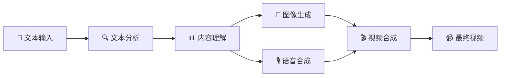

# 📺 Story Flow - AI文本到视频生成系统

[](https://www.python.org/downloads/)
[](https://github.com/astral-sh/uv)
[](LICENSE)
[](https://github.com/story-flow/story-flow)

一个强大的AI驱动文本到视频生成系统，能够将小说、故事等文本内容自动转换为包含AI生成图像、真实语音合成和精美字幕的完整视频作品。使用现代化的uv包管理器，提供快速、可靠的依赖管理体验。
demo


https://github.com/user-attachments/assets/4dd1df77-4b7a-4a04-bf7d-d14baaa8955a


https://github.com/user-attachments/assets/a45d2af8-51bb-4db7-a9eb-a546cdafe2dc


## 🎯 项目亮点

- 🤖 **全自动化流水线** - 一键从文本生成完整视频
- 🧠 **多AI模型集成** - 集成多种先进AI服务
- 🎨 **高质量视觉效果** - 专业级视频输出
- 🔧 **高度可配置** - 灵活的参数调整
- 📱 **用户友好** - 简单易用的操作界面

## ✨ 核心特性

### 🧠 智能文本处理
- **多LLM支持** - OpenAI GPT-3.5/4 / DeepSeek
- **智能分段** - 自动识别章节和段落结构
- **内容分析** - AI理解文本内容并生成描述
- **角色名替换** - 支持自定义角色名和LoRA模型映射
- **多语言支持** - 支持中英文内容处理

### 🎨 AI图像生成
- **Stable Diffusion** - 高质量AI图像生成
- **LoRA模型支持** - 风格化图像定制
- **批量处理** - 多线程并发生成
- **参数可调** - 丰富的生成参数配置

### 🎙️ 语音合成
- **Azure TTS** - 微软认知服务语音合成
- **多种音色** - 支持多种中文语音角色
- **情感表达** - 可配置语音风格和情感
- **高质量输出** - 自然流畅的语音效果

### 🎬 视频制作
- **自动合成** - 图像、语音、字幕自动合成
- **专业字幕** - 可自定义字体、颜色、位置
- **视觉特效** - 支持多种视频转场效果
- **高清输出** - 支持多种分辨率和格式

### 📚 多章节处理
- **章节识别** - 自动识别和解析多章节内容
- **顺序处理** - 按章节顺序依次处理，避免内容混乱
- **智能清理** - 每章节处理前自动清理上一章节的输出文件
- **进度跟踪** - 实时显示章节处理进度和状态
- **文件保护** - 自动保留.gitkeep文件和重要的视频输出  

## 🚀 快速开始

### 📋 系统要求

- **Python**: 3.10 或更高版本
- **操作系统**: Windows 10+, macOS 10.15+, Ubuntu 18.04+
- **内存**: 建议 8GB 以上
- **存储**: 至少 2GB 可用空间（包含spaCy中文模型）
- **网络**: 稳定的互联网连接（用于AI服务调用和模型下载）

### 🛠️ 安装步骤

#### 1. 克隆项目
```bash
git clone https://github.com/story-flow/story-flow.git
cd story-flow
```

#### 2. 环境准备
```bash
# 使用 uv 管理依赖（推荐）
curl -LsSf https://astral.sh/uv/install.sh | sh

# 创建虚拟环境并安装依赖
uv sync

# 激活虚拟环境（可选，uv run 会自动激活）
source .venv/bin/activate  # Linux/Mac
# .venv\Scripts\activate  # Windows
```

#### 3. 配置API服务
```bash
# 复制配置模板
cp .env.example .env

# 编辑配置文件，填入你的API密钥
nano .env  # 或使用你喜欢的编辑器
```

#### 4. 验证安装
```bash
# 运行环境设置脚本（自动检查和配置环境）
./setup.sh

# 测试LLM连接
uv run python -m src.pipeline.text_analyzer --test
```

> **📝 注意**: `setup.sh` 脚本会自动安装和配置所有必需的依赖。如果遇到安装问题，脚本会提供详细的错误信息和解决建议。

### 🎬 开始创作

#### 方式一：使用主程序（推荐）
```bash
# 1. 准备配置文件
cp data/input/character_mapping.json.template data/input/character_mapping.json
cp data/input/input.md.template data/input/input.md

# 2. 编辑配置文件（添加你的角色映射和故事内容）
# 编辑 data/input/character_mapping.json 和 data/input/input.md

# 3. 运行主程序
# 交互式菜单模式（支持多章节处理）
python main.py

# 或直接自动执行所有流程
python main.py --auto

# 查看所有可用选项
python main.py --help
```

**📚 多章节处理说明：**
- 程序会自动识别输入文件中的章节（以"第X章"或"Chapter X"开头的行）
- 每个章节会依次处理，生成独立的视频文件
- 处理每个新章节前会自动清理上一章节的临时文件
- 最终视频文件会保留在`data/output/videos/`目录中
- 支持中途退出和继续处理功能

#### 方式二：分步执行
```bash
# 1. 文本分析和分段
uv run python -m src.pipeline.text_analyzer

# 2. 生成图像
uv run python -m src.pipeline.image_generator

# 3. 语音合成
uv run python -m src.pipeline.voice_synthesizer

# 4. 视频合成
uv run python -m src.pipeline.video_composer
```


## 📚 完整文档

### 🎯 用户文档
- **[📖 用户指南](docs/user-guide.md)** - 完整的安装和使用教程
- **[🔧 环境配置](docs/environment-setup.md)** - 环境搭建和配置说明

### 🛠️ 开发文档  
- **[🏗️ 开发指南](docs/development-guide.md)** - 代码结构和开发说明
- **[📚 API参考](docs/api-reference.md)** - 配置参数和接口文档

## ⚙️ 配置说明

### 🔑 必需的API服务

#### 1. 大语言模型 (二选一)

**DeepSeek API (推荐)**
```env
LLM_PROVIDER=deepseek
DEEPSEEK_API_KEY=sk-your-deepseek-key
DEEPSEEK_MODEL=deepseek-chat
```

**OpenAI API**
```env
LLM_PROVIDER=openai
OPENAI_API_KEY=sk-your-openai-key
OPENAI_MODEL=gpt-3.5-turbo-16k
```

#### 2. Azure 语音服务
```env
AZURE_SPEECH_KEY=your-azure-speech-key
AZURE_SPEECH_REGION=eastasia
AZURE_VOICE_NAME=zh-CN-YunxiNeural
```

#### 3. Stable Diffusion API
```env
SD_API_URL=http://127.0.0.1:7860
SD_STEPS=30
SD_CFG_SCALE=7.5
SD_WIDTH=1360
SD_HEIGHT=1024
```

### 📝 输入文件配置

#### 角色映射配置

首次使用需要创建角色映射配置文件：

```bash
# 复制模板文件
cp data/input/character_mapping.json.template data/input/character_mapping.json
```

编辑 `character_mapping.json` 配置角色名替换和LoRA编号：

```json
[
  {
    "original_name": "小雨",
    "new_name": "红发女孩",
    "lora_id": "1"
  },
  {
    "original_name": "程宗扬",
    "new_name": "30岁黑发大叔",
    "lora_id": "2"
  }
]
```

#### 故事内容配置

```bash
# 复制模板文件
cp data/input/input.md.template data/input/input.md
```

然后编辑 `input.md` 文件，添加您的故事内容。角色名将根据上述配置自动替换。

### 🎛️ 高级配置

<details>
<summary>点击查看完整配置选项</summary>

```env
# 视频设置
VIDEO_FPS=24
VIDEO_ENABLE_EFFECT=true
VIDEO_EFFECT_TYPE=fade

# 字幕设置
SUBTITLE_FONTSIZE=48
SUBTITLE_FONTCOLOR=white
SUBTITLE_STROKE_COLOR=black
SUBTITLE_STROKE_WIDTH=2

# 性能设置
MAX_WORKERS_IMAGE=3
MAX_WORKERS_VIDEO=2
MAX_WORKERS_TRANSLATION=5
```
</details>

📖 **详细配置指南**: [环境配置文档](docs/environment-setup.md)

## 🏗️ 系统架构



### 📁 项目结构

```
story-flow/
├── 📁 src/                    # 核心源代码
│   ├── 📄 config.py           # 配置管理
│   ├── 📄 llm_client.py       # LLM客户端
│   └── 📁 pipeline/           # 处理流水线
│       ├── 📄 text_analyzer.py    # 文本分析（支持角色名替换）
│       ├── 📄 image_generator.py  # 图像生成
│       ├── 📄 voice_synthesizer.py # 语音合成
│       └── 📄 video_composer.py   # 视频合成
├── 📁 data/                   # 数据目录
│   ├── 📁 input/             # 输入文件
│   │   ├── 📄 character_mapping.json.template  # 角色映射模板
│   │   └── 📄 input.md.template               # 故事内容模板
│   ├── 📁 output/            # 输出文件
│   │   ├── 📁 images/        # 生成的图像
│   │   ├── 📁 audio/         # 生成的音频
│   │   ├── 📁 videos/        # 生成的视频
│   │   └── 📁 processed/     # 处理后的CSV文件
│   └── 📁 temp/              # 临时文件
├── 📁 tests/                  # 测试文件
│   ├── 📁 unit/              # 单元测试
│   ├── 📁 integration/       # 集成测试
│   └── 📁 fixtures/          # 测试数据
├── 📁 docs/                   # 文档
├── 📄 main.py                # 主程序入口
├── 📄 pyproject.toml         # 项目配置（uv管理）
├── 📄 uv.lock               # 依赖锁定文件
├── 📄 setup.sh              # 环境设置脚本
└── 📄 cleanup.sh            # 清理脚本
```

## 🎯 使用场景

- 📚 **小说可视化** - 将小说章节转换为视频
- 🎓 **教育内容** - 制作教学视频和课件
- 📖 **故事讲述** - 儿童故事、寓言等
- 🎬 **内容创作** - 自媒体视频制作
- 📱 **社交媒体** - 短视频内容生成

## 🔧 技术栈

- **🐍 Python 3.10+** - 核心开发语言
- **📦 uv** - 现代化Python包管理器
- **🤖 OpenAI/DeepSeek API** - 大语言模型服务
- **🎨 Stable Diffusion** - AI图像生成
- **🎙️ Azure Cognitive Services** - 语音合成
- **🎬 MoviePy** - 视频处理
- **📊 Pandas** - 数据处理
- **🖼️ Pillow** - 图像处理
- **🎵 Pydub** - 音频处理

## 🧹 项目维护

### 清理生成文件
```bash
# 运行清理脚本（交互式选择清理内容）
./cleanup.sh

# 清理脚本功能：
# - 清理生成的图片、音频文件
# - 清理临时文件和缓存
# - 整理输入文件到指定目录
# - 显示磁盘空间使用统计
# - 自动保留.gitkeep文件和videos目录中的重要文件
```

**🛡️ 智能清理保护：**
- 程序内置智能清理功能，在处理新章节前自动清理临时文件
- 自动保护重要文件：`.gitkeep`文件和`videos`目录中的视频文件
- 只清理必要的临时文件（图片、音频、CSV），避免误删重要内容
- 清理过程中如遇错误不会中断主流程，确保程序稳定运行

## 🤝 贡献指南

我们欢迎所有形式的贡献！请查看 [贡献指南](CONTRIBUTING.md) 了解详情。

### 🐛 问题反馈

如果您遇到问题或有建议，请：
1. 查看 [常见问题](docs/FAQ.md)
2. 搜索现有的 [Issues](https://github.com/story-flow/story-flow/issues)
3. 创建新的 Issue 并提供详细信息

### 📝 开发计划

#### 已实现功能
- [x] 📝 智能文本分析与分段 - 自动分析故事内容并智能分段
- [x] 🎨 AI图像生成 - 根据文本描述自动生成配图
- [x] 🎙️ 智能语音合成 - 将文本转换为自然语音
- [x] 🎬 自动视频合成 - 将图片、音频合成为完整视频
- [x] 👥 角色管理系统 - 支持多角色配置和替换
- [x] 📊 灵活数据格式 - 支持CSV和Excel多种输入格式
- [x] 🔧 现代化包管理 - 使用uv进行快速依赖管理
- [x] 🧪 完整测试覆盖 - 单元测试和集成测试
- [x] 📚 多章节处理 - 支持按章节顺序处理长篇内容
- [x] 🧹 智能清理系统 - 自动清理输出文件，保留重要文件

#### 核心功能扩展
- [ ] 🎬 图生视频功能 - 基于AI技术实现图片到视频的转换
- [ ] 🎙️ GPT-SoVITS语音克隆 - 实现个性化语音合成
- [ ] 📱 剪映草稿自动生成 - 自动生成剪映可导入的项目文件
- [ ] 🎵 智能音乐音效生成 - AI驱动的背景音乐和音效自动配置

#### 系统优化
- [ ] 🎤 更多语音服务商支持 - 扩展语音合成选择
- [ ] 🎞️ 视频模板系统 - 提供多样化视频风格模板
- [ ] 👀 实时预览功能 - 生成过程可视化预览
- [ ] 🌐 Web界面开发 - 提供友好的网页操作界面
- [ ] 🐳 Docker容器化部署 - 简化部署和分发流程
- [ ] ⚡ 性能优化 - 多线程处理和缓存机制
- [ ] 🔄 增量更新 - 支持部分内容更新而非全量重新生成

#### 远期规划
- [ ] 🔥 网络热点内容转化 - 自动抓取和分析网络热点，转化为视频内容
- [ ] 🤖 视频生成Agent - 开发智能视频生成代理，实现全自动化内容创作
- [ ] 📊 数据驱动优化 - 基于用户反馈和数据分析优化生成效果
- [ ] 🎯 个性化推荐 - 根据用户偏好推荐内容风格和模板
- [ ] 🌍 多语言支持 - 扩展到更多语言的内容生成和处理

## 📞 联系方式

如果您在使用过程中遇到问题或有任何建议，欢迎通过以下方式联系我们：

### 🐛 问题反馈
- **GitHub Issues**: [提交Bug报告或功能请求](https://github.com/story-flow/story-flow/issues)
- **问题模板**: 请使用相应的Issue模板，提供详细的问题描述和复现步骤

### 💬 交流讨论
- **GitHub Discussions**: [参与项目讨论](https://github.com/story-flow/story-flow/discussions)
- **功能建议**: 在Discussions中分享您的想法和建议
- **使用经验**: 分享您的使用心得和最佳实践

### 📧 直接联系
- **项目维护者**: [dasenrising@gmail.com](mailto:dasenrising@gmail.com)
- **技术支持**: [dasenrising@gmail.com](mailto:dasenrising@gmail.com)
- **商务合作**: [dasenrising@gmail.com](mailto:dasenrising@gmail.com)

### 🌐 社交媒体
- **微信群**: 扫描下方二维码加入交流群

<div align="center">
  
  <p><em>扫描二维码加入Story Flow用户交流群</em></p>
</div>

---

## 📄 许可证

本项目采用 [MIT 许可证](LICENSE) - 详情请查看 LICENSE 文件。

## 🙏 致谢

感谢以下开源项目和服务：
- [OpenAI](https://openai.com/) - GPT模型服务
- [DeepSeek](https://www.deepseek.com/) - 高性价比LLM服务
- [Azure Cognitive Services](https://azure.microsoft.com/services/cognitive-services/) - 语音合成服务
- [Stable Diffusion](https://stability.ai/) - AI图像生成
- [MoviePy](https://zulko.github.io/moviepy/) - 视频处理库
- [uv](https://github.com/astral-sh/uv) - 现代化Python包管理器

---

<div align="center">

**🌟 如果这个项目对您有帮助，请给我们一个 Star！**

**📚 完整使用教程请查看上方文档链接**

[🏠 主页](https://github.com/story-flow/story-flow) • [📖 文档](docs/) • [🐛 问题反馈](https://github.com/story-flow/story-flow/issues) • [💬 讨论](https://github.com/story-flow/story-flow/discussions)

</div>
