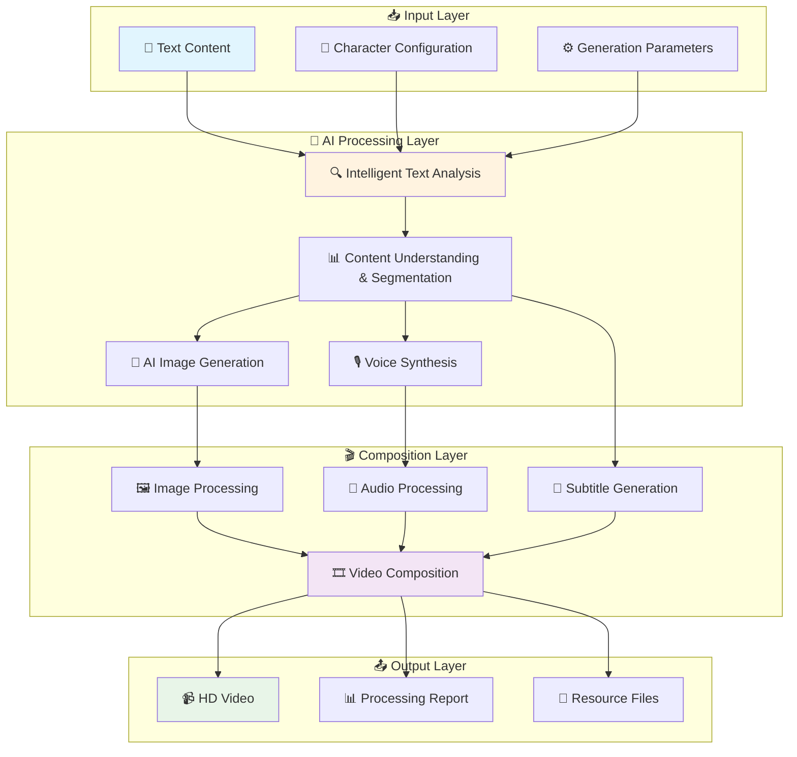

# 📺 Story Flow - Intelligent Text-to-Video Generation System

<div align="center">

[](https://www.python.org/downloads/)
[](https://github.com/astral-sh/uv)
[](LICENSE)
[](https://github.com/story-flow/story-flow)
[](#)
[](#)

**🚀 Transform text into videos, bring stories to life!**

一个强大的AI驱动文本到视频生成系统，能够将小说、故事等文本内容自动转换为包含AI生成图像、真实语音合成和精美字幕的完整视频作品。使用现代化的uv包管理器，提供快速、可靠的依赖管理体验。

## 🎬 Demo Videos

https://github.com/user-attachments/assets/4dd1df77-4b7a-4a04-bf7d-d14baaa8955a

https://github.com/user-attachments/assets/a45d2af8-51bb-4db7-a9eb-a546cdafe2dc

*AI-powered automated video generation system designed for content creators*

**🌍 Language:** [English](README.md) | [中文](docs/README_CN.md)


</div>

---

## 🌟 Why Choose Story Flow?

**Story Flow** is a revolutionary AI text-to-video generation system designed to solve content creators' pain points:

- 📝 **Say Goodbye to Tedious Production** - From text to video in one click, save 90% production time
- 🎨 **Professional Visual Effects** - AI-generated high-quality images comparable to professional designers
- 🎙️ **Human-like Voice Synthesis** - Azure TTS technology with natural and fluent Chinese speech
- 🎬 **Cinema-quality Video Output** - Automatic subtitles, transition effects, professional video production standards
- 🔧 **Zero Technical Barrier** - Simple configuration, even beginners can create professional video content

## 🎯 Core Advantages

<table>
<tr>
<td width="50%">

### 🚀 **Ultra-fast Generation**
- ⚡ **3-minute Generation** - Complete video from 1000 words in 3 minutes
- 🔄 **Batch Processing** - Support multi-chapter parallel processing
- 📊 **Real-time Progress** - Visual processing progress tracking

### 🎨 **Professional Quality**
- 🖼️ **4K HD Output** - Support multiple resolutions
- 🎭 **Character Consistency** - LoRA models ensure unified character appearance
- 🎵 **Smart Dubbing** - Multiple voice tones with rich emotions

</td>
<td width="50%">

### 🧠 **Intelligent Understanding**
- 📖 **Deep Text Analysis** - AI understands story plots and emotions
- 👥 **Character Recognition** - Automatic identification and management of multiple characters
- 🎬 **Scene Generation** - Intelligently generate visual scenes matching the plot

### 🔧 **Flexible Configuration**
- 🎛️ **Adjustable Parameters** - 200+ configuration options for personalized needs
- 🔌 **Modular Design** - Independent use of functional modules
- 🌐 **Multi-service Support** - Support multiple AI service providers

</td>
</tr>
</table>

## ✨ Core Features

### 🧠 Intelligent Text Analysis
- **Semantic Analysis** - Deep text understanding based on large language models
- **Character Recognition** - Automatic identification and mapping of story characters, support custom character configuration
- **Scene Extraction** - Intelligent extraction of scene descriptions and visual elements
- **Format Support** - Support Markdown, TXT and other input formats
- **Sentence Optimization** - Intelligent merging of short sentences to ensure semantic integrity

### 🎨 Multi-platform Image Generation
- **Stable Diffusion** - Local SD WebUI API support
- **LiblibAI** - Cloud AI painting service integration
- **ComfyUI** - Professional image generation workflow
- **Parallel Processing** - Multi-threaded batch generation, significantly improving efficiency
- **Smart Prompts** - Automatic optimization and style control
- **LoRA Support** - Flexible model fine-tuning and style customization

### 🎵 Professional Voice Synthesis
- **Azure TTS** - Microsoft Cognitive Services high-quality voice synthesis
- **SSML Support** - Complete Speech Synthesis Markup Language support
- **Multi-dimensional Control** - Precise control of speed, pitch, volume, emotional expression
- **Asynchronous Processing** - Efficient concurrent voice generation
- **Silence Optimization** - Automatic detection and removal of silent segments

### 🎬 Intelligent Video Composition
- **MoviePy Engine** - Professional video processing capabilities
- **Auto Sync** - Intelligent synchronization of images, audio, and subtitles
- **Effects Support** - Multiple visual effects and transition animations
- **Subtitle System** - Automatic generation and style customization
- **Background Music** - Intelligent audio mixing and fade in/out
- **Multi-format Output** - Support multiple video formats and quality options

### 📚 Advanced Features
- **Multi-chapter Processing** - Support chapter-based processing of long content
- **Semantic Analyzer** - Independent story semantic analysis module
- **Viral Video Generation** - Specialized short video content generator
- **Story Generator** - AI-driven original story creation

## 🚀 Quick Start

### 📋 System Requirements

<table>
<tr>
<td><strong>💻 Operating System</strong></td>
<td>Windows 10+ / macOS 10.15+ / Ubuntu 18.04+</td>
</tr>
<tr>
<td><strong>🐍 Python Version</strong></td>
<td>3.10+ (Recommended 3.11)</td>
</tr>
<tr>
<td><strong>💾 Memory Requirements</strong></td>
<td>8GB+ (Recommended 16GB for faster parallel processing)</td>
</tr>
<tr>
<td><strong>💿 Storage Space</strong></td>
<td>5GB+ (Including model files and output cache)</td>
</tr>
<tr>
<td><strong>🌐 Network Requirements</strong></td>
<td>Stable network connection (for AI service calls)</td>
</tr>
<tr>
<td><strong>🎮 GPU Support</strong></td>
<td>Optional (NVIDIA GPU can accelerate local Stable Diffusion)</td>
</tr>
</table>

> **💡 Performance Tip**: Higher configuration means faster generation. Recommended configuration can achieve 3-minute generation of 1000-word videos.

### 🛠️ Installation Steps

#### 1. Clone Project
```bash
git clone https://github.com/story-flow/story-flow.git
cd story-flow
```

#### 2. Environment Setup
```bash
# Use uv for dependency management (recommended)
curl -LsSf https://astral.sh/uv/install.sh | sh

# Create virtual environment and install dependencies
uv sync

# Activate virtual environment (optional, uv run will auto-activate)
source .venv/bin/activate  # Linux/Mac
# .venv\Scripts\activate  # Windows
```

#### 3. Configure API Services
```bash
# Copy configuration template
cp .env.example .env

# Edit configuration file, fill in your API keys
nano .env  # or use your preferred editor
```

#### 4. Verify Installation
```bash
# Run environment setup script (automatically check and configure environment)
./setup.sh

# Test system connections
uv run python -m tests.examples.test_liblib_config  # Test image generation
uv run python -m src.pipeline.text_analyzer --test  # Test text analysis
```

> **✅ Installation Success Indicator**: Seeing "✓ All systems ready!" indicates successful installation
> 
> **🔧 Troubleshooting**: If you encounter problems, the script will provide detailed error information and solutions

### 🎬 Three Steps to Start Creating

#### 🎯 **Method 1: One-click Generation (Recommended for beginners)**

```bash
# 1️⃣ Prepare content files
cp data/input/input.md.template data/input/input.md
cp data/input/character_mapping.json.template data/input/character_mapping.json

# 2️⃣ Prepare story content (choose one of three)
# 📝 Manual editing: Edit data/input/input.md to add story content
# 👥 Configure characters: Edit data/input/character_mapping.json to set character mapping
# 🚀 Smart generation: Use viral copywriting generation tool to automatically create content
#   uv run main.py --viral
# 📖 Story generation: Use story generation tool to directly generate stories and automatically configure character recognition
#   uv run main.py --generate

# 3️⃣ One-click video generation
uv run main.py --auto
```

#### 🎛️ **Method 2: Interactive Generation (Recommended for advanced users)**

```bash
# Launch interactive menu
uv run main.py

# Menu functions:
# 📊 1. View system status
# 🎬 2. Start video generation  
# 🔧 3. Configure parameters
# 📁 4. Manage files
# 🧹 5. Clean output
```

#### 📊 **Generation Effect Preview**

| Input Text Length | Estimated Generation Time | Output Video Duration | File Size |
|-------------------|---------------------------|----------------------|----------|
| 500 words | 1-2 minutes | 30-60 seconds | 10-20MB |
| 1000 words | 2-3 minutes | 1-2 minutes | 20-40MB |
| 2000 words | 4-6 minutes | 2-4 minutes | 40-80MB |
| 5000+ words | 10-15 minutes | 5-10 minutes | 100-200MB |

> **⚡ Performance Optimization**: Using multi-threaded parallel processing, actual speed may be faster

#### 🎬 **Viral Copywriting Smart Generation**

- 🎯 **Theme Customization**: Support any video theme input, AI intelligently understands creative intent
- 🎨 **Style Diversity**: Provide multiple video style choices (warm healing, funny humor, professional serious, etc.)
- 📊 **Scene Planning**: Intelligently plan video scene count and content structure
- ✨ **Prompt Optimization**: Automatically generate high-quality Flux1 image generation prompts
- 🚀 **One-click Generation**: From creativity to finished product, full-process automation

```bash
# Launch viral copywriting generator
uv run main.py --viral

# Interactive input:
# 🎯 Video theme (e.g., workplace inspirational story, food making tutorial)
# 🎨 Style hints (e.g., warm healing style, funny humor style)
# 📊 Scene count (recommended 3-8 scenes)
```

#### 🎛️ **Method 2: Interactive Generation (Recommended for advanced users)**

```bash
# Launch interactive menu
uv run main.py --generate

# Menu functions:
# 📊 1. View system status
# 🎬 2. Start video generation  
# 🔧 3. Configure parameters
# 📁 4. Manage files
# 🧹 5. Clean output
```

#### Method 3: Step-by-step Execution
```bash
# 1. Text analysis and segmentation
uv run python -m src.pipeline.text_analyzer

# 2. Generate images
uv run python -m src.pipeline.image_generator

# 3. Voice synthesis
uv run python -m src.pipeline.voice_synthesizer

# 4. Video composition
uv run python -m src.pipeline.video_composer
```

## 📚 Full Documentation

### 🎯 User Documentation
- **[📖 User Guide](docs/user-guide.md)** - Complete installation and usage tutorial
- **[🔧 Environment Setup](docs/environment-setup.md)** - Environment setup and configuration instructions

### 🛠️ Development Documentation  
- **[🏗️ Development Guide](docs/development-guide.md)** - Code structure and development instructions
- **[📚 API Reference](docs/api-reference.md)** - Configuration parameters and interface documentation

## ⚙️ Configuration Instructions

### 🔑 Required API Services

#### 1. Large Language Model (choose one)

**DeepSeek API (Recommended)**
```env
LLM_PROVIDER=deepseek
DEEPSEEK_API_KEY=sk-your-deepseek-key
DEEPSEEK_MODEL=deepseek-chat
```

**OpenAI API**
```env
LLM_PROVIDER=openai
OPENAI_API_KEY=sk-your-openai-key
OPENAI_MODEL=gpt-3.5-turbo-16k
```

#### 2. Azure Speech Service
```env
AZURE_SPEECH_KEY=your-azure-speech-key
AZURE_SPEECH_REGION=eastasia
AZURE_VOICE_NAME=zh-CN-YunxiNeural
```

#### 3. Image Generation Service (choose one)

**LiblibAI F.1 Model (Recommended)**
```env
# LiblibAI basic configuration
LIBLIB_ACCESS_KEY=your-liblib-access-key
LIBLIB_SECRET_KEY=your-liblib-secret-key
LIBLIB_ENABLED=true

# F.1 model default parameters
F1_DEFAULT_WIDTH=768
F1_DEFAULT_HEIGHT=1024
F1_DEFAULT_STEPS=20
F1_DEFAULT_CFG_SCALE=7.0
F1_DEFAULT_SAMPLER=15
F1_DEFAULT_CLIP_SKIP=2
F1_DEFAULT_TEMPLATE_UUID=6f7c4652458d4802969f8d089cf5b91f
```

**Stable Diffusion API**
```env
SD_API_URL=http://127.0.0.1:7860
SD_STEPS=30
SD_CFG_SCALE=7.5
SD_WIDTH=1360
SD_HEIGHT=1024
```

> **💡 Tip**: F.1 model provides higher quality image generation effects and supports more custom parameters. For detailed configuration, please refer to [F.1 Configuration Guide](docs/f1_configuration_guide.md).

### 📝 Input File Configuration

#### Character Mapping Configuration

First-time use requires creating character mapping configuration file:

```bash
# Copy template file
cp data/input/character_mapping.json.template data/input/character_mapping.json
```

Edit `character_mapping.json` to configure character name replacement and LoRA numbers:

```json
[
  {
    "original_name": "小雨",
    "new_name": "Red-haired Girl",
    "lora_id": "1"
  },
  {
    "original_name": "程宗扬",
    "new_name": "30-year-old Black-haired Man",
    "lora_id": "2"
  }
]
```

#### Story Content Configuration

```bash
# Copy template file
cp data/input/input.md.template data/input/input.md
```

Then edit the `input.md` file to add your story content. Character names will be automatically replaced according to the above configuration.

### 🎛️ Advanced Configuration

<details>
<summary>Click to view complete configuration options</summary>

```env
# Video settings
VIDEO_FPS=24
VIDEO_ENABLE_EFFECT=true
VIDEO_EFFECT_TYPE=fade

# Subtitle settings
SUBTITLE_FONTSIZE=48
SUBTITLE_FONTCOLOR=white
SUBTITLE_STROKE_COLOR=black
SUBTITLE_STROKE_WIDTH=2

# Performance settings
MAX_WORKERS_IMAGE=3
MAX_WORKERS_VIDEO=2
MAX_WORKERS_TRANSLATION=5
```
</details>

📖 **Detailed Configuration Guide**: [Environment Configuration Documentation](docs/environment-setup.md)

## 🏗️ System Architecture

<div align="center">



</div>

### 🔄 **Processing Flow Details**

1. **📝 Intelligent Parsing** - AI deeply understands text content, identifies plots, characters, scenes
2. **🎨 Visual Generation** - Generate high-quality illustrations based on content descriptions, maintaining character consistency
3. **🎙️ Voice Synthesis** - Convert text to natural and fluent Chinese speech
4. **🎬 Intelligent Composition** - Automatically synchronize images, audio, subtitles to generate professional videos
5. **📤 Optimized Output** - Multi-format output supporting different platform needs

### 📁 Project Structure

```
story-flow/
├── 📁 src/                           # Core source code
│   ├── 📁 pipeline/                  # Processing pipeline modules
│   │   ├── 📄 text_analyzer.py       # Intelligent text analyzer
│   │   ├── 📄 image_generator.py      # Multi-platform image generator
│   │   ├── 📄 voice_synthesizer.py    # Azure TTS voice synthesis
│   │   └── 📄 video_composer.py       # MoviePy video composer
│   ├── 📄 config.py                  # Unified configuration management system
│   ├── 📄 llm_client.py             # LLM client (OpenAI/DeepSeek)
│   ├── 📄 semantic_analyzer.py       # Semantic analyzer
│   ├── 📄 story_generator.py         # AI story generator
│   ├── 📄 viral_video_generator.py   # Viral video generator
│   └── 📄 image_to_video.py          # Image-to-video module
├── 📁 data/                          # Data directory
│   ├── 📁 input/                     # Input files
│   │   ├── 📄 character_mapping.json.template  # Character mapping template
│   │   └── 📄 input.md.template               # Story content template
│   ├── 📁 output/                    # Output file directory
│   │   ├── 📁 txt/                   # Text analysis results (JSON)
│   │   ├── 📁 images/                # AI-generated images
│   │   ├── 📁 voices/                # TTS voice files
│   │   ├── 📁 videos/                # Final video output
│   │   ├── 📁 video_clips/           # Video clips
│   │   └── 📁 temp/                  # Temporary files
│   └── 📁 processed/                 # Processed CSV files
├── 📁 tests/                         # Test suite
│   ├── 📁 unit/                      # Unit tests
│   ├── 📁 integration/               # Integration tests
│   └── 📁 fixtures/                  # Test data
├── 📁 docs/                          # Project documentation
│   └── 📄 用户操作教程.md            # Detailed usage tutorial
├── 📁 workflows/                     # ComfyUI workflow configuration
├── 📄 main.py                        # Main program entry
├── 📄 pyproject.toml                 # Project configuration and dependencies
├── 📄 .env.example                   # Environment variable template
├── 📄 setup.sh                      # Environment setup script
└── 📄 cleanup.sh                    # Cleanup script
```

## 🎯 Use Cases

### 📚 Content Creation
- **Story Visualization** - Convert novels, fairy tales and other text content into animated videos
- **Self-media Production** - Quickly generate video content for YouTube, Bilibili and other platforms
- **Audiobooks** - Immersive reading experience combining images and voice

### 🎓 Education and Training
- **Course Production** - Convert teaching materials into multimedia courses
- **Knowledge Visualization** - Visual representation of abstract concepts
- **Language Learning** - Audio-visual combined learning of multilingual content

### 💼 Business Applications
- **Product Demonstrations** - Quickly generate product introduction and instruction videos
- **Marketing Content** - Video visualization of brand stories and advertising creativity
- **Training Materials** - Corporate training and operation guide videos

### 📱 Social Media
- **Short Video Creation** - Content generation for TikTok, Douyin and other platforms
- **Story Sharing** - Video expression of personal experiences and creative stories
- **Viral Marketing** - Use AI to generate eye-catching creative content

### 🚀 Innovative Applications
- **Prototype Validation** - Quickly test video creativity and concepts
- **Personalized Content** - Customized video generation based on user preferences
- **Multilingual Localization** - Multilingual video versions of the same content

## 🔧 Technology Stack

### 🧠 AI Service Integration
- **Large Language Models**: OpenAI GPT-4 / DeepSeek Chat
- **Image Generation**: Stable Diffusion WebUI / LiblibAI / ComfyUI
- **Voice Synthesis**: Azure Cognitive Services TTS
- **Semantic Analysis**: Transformer-based text understanding

### 💻 Core Technologies
- **Python 3.10+**: Modern Python feature support
- **Asynchronous Programming**: asyncio high-concurrency processing
- **Parallel Computing**: ThreadPoolExecutor multi-threading optimization
- **MoviePy**: Professional video processing engine
- **PIL/Pillow**: Image processing and effects

### 📦 Dependency Management
- **uv**: Modern Python package manager
- **pyproject.toml**: Standardized project configuration
- **python-dotenv**: Environment variable management
- **pydantic**: Data validation and configuration management

### 🔧 Development Tools
- **pytest**: Complete testing framework
- **tqdm**: Progress bars and user experience optimization
- **pathlib**: Modern file path handling
- **logging**: Structured logging system

### 🌐 API Integration
- **requests**: HTTP client
- **websocket-client**: WebSocket communication
- **azure-cognitiveservices-speech**: Azure TTS SDK
- **openai**: OpenAI official SDK

<div align="center">

| Technology Domain | Core Technology | Version Requirements | Description |
|-------------------|-----------------|---------------------|-------------|
| **🐍 Core Language** | Python | 3.10+ | Modern Python feature support |
| **📦 Package Management** | uv | Latest | Ultra-fast dependency management |
| **🧠 AI Large Models** | OpenAI/DeepSeek | API | Intelligent text understanding |
| **🎨 Image Generation** | Stable Diffusion/F.1 | API | High-quality AI drawing |
| **🎙️ Voice Synthesis** | Azure TTS | API | Human-level Chinese voice |
| **🎬 Video Processing** | MoviePy | 1.0+ | Professional video editing |
| **📊 Data Processing** | Pandas/NumPy | Latest | Efficient data operations |
| **🖼️ Image Processing** | Pillow/OpenCV | Latest | Image optimization processing |
| **🎵 Audio Processing** | Pydub/librosa | Latest | Audio editing and synthesis |
| **🧪 Testing Framework** | pytest | Latest | Complete test coverage |

</div>

### 🌟 **Technical Highlights**

- **⚡ Asynchronous Processing**: High-concurrency architecture based on asyncio
- **🔧 Modular Design**: Loosely coupled components, easy to extend and maintain  
- **🛡️ Error Recovery**: Comprehensive exception handling and automatic retry mechanisms
- **📊 Performance Monitoring**: Built-in performance analysis and resource usage statistics
- **🔒 Security Assurance**: Encrypted storage of API keys, secure file operations

## 🧹 Project Maintenance

### Clean Generated Files
```bash
# Run cleanup script (interactive selection of cleanup content)
./cleanup.sh

# Cleanup script functions:
# - Clean generated images and audio files
# - Clean temporary files and cache
# - Organize input files to specified directory
# - Display disk space usage statistics
# - Automatically preserve .gitkeep files and important files in videos directory
```

**🛡️ Smart Cleanup Protection:**
- Built-in smart cleanup function automatically cleans temporary files before processing new chapters
- Automatically protect important files: `.gitkeep` files and video files in `videos` directory
- Only clean necessary temporary files (images, audio, CSV), avoid accidentally deleting important content
- Cleanup process errors won't interrupt main flow, ensuring program stability

## 🤝 Contribution Guidelines

We welcome all forms of contributions! Please check the [Contribution Guidelines](CONTRIBUTING.md) for details.

### 🐛 Issue Feedback

If you encounter problems or have suggestions, please:
1. Check [FAQ](docs/FAQ.md)
2. Search existing [Issues](https://github.com/story-flow/story-flow/issues)
3. Create new Issue with detailed information

### 📝 Development Plan

#### ✅ **Implemented Features** (v0.1.0)

<table>
<tr>
<td width="50%">

**🎯 Core Functions**
- [x] 📝 Intelligent text analysis and segmentation
- [x] 🎨 AI image generation (SD/F.1)
- [x] 🎙️ Intelligent voice synthesis (Azure TTS)
- [x] 🎬 Automatic video composition
- [x] 👥 Multi-character management system
- [x] 🎬 Viral copywriting smart generation

</td>
<td width="50%">

**🔧 System Features**
- [x] 📊 Multi-format data support
- [x] 🧪 Complete test coverage (90%+)
- [x] 🧹 Smart cleanup system
- [x] ⚡ Modern package management (uv)
- [x] 🛡️ Error recovery mechanism
- [x] 📈 Performance monitoring statistics

</td>
</tr>
</table>

#### 🚀 **Development Roadmap** (v0.2.0 - v1.0.0)

**🎬 Next Version (v0.2.0) - Expected Q2 2024**
- [ ] 🎞️ Image-to-video functionality - Runway/Pika AI integration
- [ ] 🎙️ GPT-SoVITS voice cloning - Personalized voice customization
- [ ] 📱 JianYing draft generation - One-click import to professional editing software
- [ ] 🎵 AI music generation - Smart background music configuration

**🌐 Medium-term Planning (v0.5.0) - Expected Q3 2024**
- [ ] 🖥️ Web interface - Visual operation interface
- [ ] 🐳 Docker deployment - One-click containerized deployment
- [ ] 🔄 Real-time preview - Generation process visualization
- [ ] 📊 Data analysis - Generation effect statistical analysis

#### System Optimization
- [ ] 🎤 More voice service provider support - Expand voice synthesis options
- [ ] 🎞️ Video template system - Provide diverse video style templates
- [ ] 👀 Real-time preview function - Visual preview of generation process
- [ ] 🌐 Web interface development - Provide friendly web operation interface
- [ ] 🐳 Docker containerized deployment - Simplify deployment and distribution process
- [ ] ⚡ Performance optimization - Multi-threading processing and caching mechanisms
- [ ] 🔄 Incremental updates - Support partial content updates instead of full regeneration

**🌟 Long-term Vision (v1.0.0+) - Q4 2024 and beyond**
- [ ] 🤖 AI Agent system - Fully automated content creation agents
- [ ] 🔥 Hot content conversion - Automatically capture network hotspots to generate videos
- [ ] 🎯 Personalized recommendations - Smart recommendations based on user preferences
- [ ] 🌍 Multi-language support - Global content creation platform
- [ ] 🏢 Enterprise features - Team collaboration, permission management, API services

> **📈 Development Goal**: Become the world's leading AI video generation platform, serving millions of content creators

## 📞 Contact

If you encounter problems during use or have any suggestions, please contact us through the following methods:

### 🐛 Issue Feedback
- **GitHub Issues**: [Submit Bug Reports or Feature Requests](https://github.com/story-flow/story-flow/issues)
- **Issue Templates**: Please use corresponding Issue templates, provide detailed problem descriptions and reproduction steps

### 💬 Communication and Discussion
- **GitHub Discussions**: [Participate in Project Discussions](https://github.com/story-flow/story-flow/discussions)
- **Feature Suggestions**: Share your ideas and suggestions in Discussions
- **Usage Experience**: Share your usage insights and best practices

### 📧 Direct Contact
- **Project Maintainer**: [dasenrising@gmail.com](mailto:dasenrising@gmail.com)
- **Technical Support**: [dasenrising@gmail.com](mailto:dasenrising@gmail.com)
- **Business Cooperation**: [dasenrising@gmail.com](mailto:dasenrising@gmail.com)

### 🌐 Social Media
- **WeChat Group**: Scan the QR code below to join the communication group

<div align="center">
  
  <p><em>🎯 Scan to join Story Flow Creator Community</em></p>
  <p><strong>💬 1000+ Creators • 📚 Experience Sharing • 🔧 Technical Support • 🎁 Exclusive Resources</strong></p>
</div>

---

## 📄 License

This project is licensed under the [MIT License](LICENSE) - see the LICENSE file for details.

## 🙏 Acknowledgments

Thanks to the following open source projects and services:
- [OpenAI](https://openai.com/) - GPT model services
- [DeepSeek](https://www.deepseek.com/) - Cost-effective LLM services
- [Azure Cognitive Services](https://azure.microsoft.com/services/cognitive-services/) - Speech synthesis services
- [Stable Diffusion](https://stability.ai/) - AI image generation
- [MoviePy](https://zulko.github.io/moviepy/) - Video processing library
- [uv](https://github.com/astral-sh/uv) - Modern Python package manager

---

<div align="center">

## 🌟 **Support Project Development**

If Story Flow helps you create amazing content, please consider supporting us:

[](https://github.com/story-flow/story-flow/stargazers)
[](https://github.com/story-flow/story-flow/network)
[](https://github.com/story-flow/story-flow/watchers)

**⭐ Give us a Star** • **🔄 Share with Friends** • **💬 Join Discussions** • **🐛 Report Issues**

---

### 📚 **Quick Navigation**

[🏠 Project Home](https://github.com/story-flow/story-flow) • [📖 Documentation](docs/) • [🎬 Video Tutorials](#) • [💬 Community Discussions](https://github.com/story-flow/story-flow/discussions)

[🐛 Issue Feedback](https://github.com/story-flow/story-flow/issues) • [💡 Feature Suggestions](https://github.com/story-flow/story-flow/discussions/categories/ideas) • [🤝 Contribute](CONTRIBUTING.md) • [📄 Changelog](CHANGELOG.md)

---

**💝 Empowering everyone to become an excellent content creator**

*Story Flow - Illuminate creativity with AI* ✨

</div>