# 📺 Story Flow - AI文本到视频生成系统

[](https://www.python.org/downloads/)
[](LICENSE)
[](https://github.com/your-username/story-flow)

一个强大的AI驱动文本到视频生成系统，能够将小说、故事等文本内容自动转换为包含AI生成图像、真实语音合成和精美字幕的完整视频作品。

## 🎯 项目亮点

- 🤖 **全自动化流水线** - 一键从文本生成完整视频
- 🧠 **多AI模型集成** - 集成多种先进AI服务
- 🎨 **高质量视觉效果** - 专业级视频输出
- 🔧 **高度可配置** - 灵活的参数调整
- 📱 **用户友好** - 简单易用的操作界面

## ✨ 核心特性

### 🧠 智能文本处理
- **多LLM支持** - OpenAI GPT-3.5/4 / DeepSeek (性价比更高)
- **智能分段** - 自动识别章节和段落结构
- **内容分析** - AI理解文本内容并生成描述
- **多语言支持** - 支持中英文内容处理

### 🎨 AI图像生成
- **Stable Diffusion** - 高质量AI图像生成
- **LoRA模型支持** - 风格化图像定制
- **批量处理** - 多线程并发生成
- **参数可调** - 丰富的生成参数配置

### 🎙️ 语音合成
- **Azure TTS** - 微软认知服务语音合成
- **多种音色** - 支持多种中文语音角色
- **情感表达** - 可配置语音风格和情感
- **高质量输出** - 自然流畅的语音效果

### 🎬 视频制作
- **自动合成** - 图像、语音、字幕自动合成
- **专业字幕** - 可自定义字体、颜色、位置
- **视觉特效** - 支持多种视频转场效果
- **高清输出** - 支持多种分辨率和格式  

## 🚀 快速开始

### 📋 系统要求

- **Python**: 3.10 或更高版本
- **操作系统**: Windows 10+, macOS 10.15+, Ubuntu 18.04+
- **内存**: 建议 8GB 以上
- **存储**: 至少 2GB 可用空间
- **网络**: 稳定的互联网连接（用于AI服务调用）

### 🛠️ 安装步骤

#### 1. 克隆项目
```bash
git clone https://github.com/your-username/story-flow.git
cd story-flow
```

#### 2. 环境准备
```bash
# 使用 uv 管理依赖（推荐）
curl -LsSf https://astral.sh/uv/install.sh | sh

# 创建虚拟环境并安装依赖
uv sync

# 或使用传统方式（不推荐）
python -m venv .venv
source .venv/bin/activate  # Linux/Mac
# .venv\Scripts\activate  # Windows
# 注意：本项目使用 uv 管理依赖，建议使用上述 uv 方式
```

#### 3. 配置API服务
```bash
# 复制配置模板
cp .env.example .env

# 编辑配置文件，填入你的API密钥
nano .env  # 或使用你喜欢的编辑器
```

#### 4. 验证安装
```bash
# 运行环境检查
uv run python scripts/setup_env.py

# 测试LLM连接
uv run python scripts/test_llm.py
```

### 🎬 开始创作

#### 方式一：全自动流水线
```bash
# 准备你的文本文件
echo "第一章 神秘的开始\n\n在一个月黑风高的夜晚..." > data/input/story.txt

# 一键生成视频
uv run python scripts/auto_pipeline.py
```

#### 方式二：分步执行
```bash
# 1. 文本分析和分段
uv run python src/pipeline/text_splitter.py

# 2. 内容分析和翻译
uv run python src/pipeline/text_analyzer.py

# 3. 生成图像
uv run python src/pipeline/image_generator.py

# 4. 语音合成
uv run python src/pipeline/voice_synthesizer.py

# 5. 视频合成
uv run python src/pipeline/video_composer.py
```

## 📚 完整文档

### 🎯 用户文档
- **[📖 用户指南](docs/user-guide.md)** - 完整的安装和使用教程
- **[🔧 环境配置](docs/environment-setup.md)** - 环境搭建和配置说明

### 🛠️ 开发文档  
- **[🏗️ 开发指南](docs/development-guide.md)** - 代码结构和开发说明
- **[📚 API参考](docs/api-reference.md)** - 配置参数和接口文档

## ⚙️ 配置说明

### 🔑 必需的API服务

#### 1. 大语言模型 (二选一)

**DeepSeek API (推荐 - 性价比高)**
```env
LLM_PROVIDER=deepseek
DEEPSEEK_API_KEY=sk-your-deepseek-key
DEEPSEEK_MODEL=deepseek-chat
```

**OpenAI API**
```env
LLM_PROVIDER=openai
OPENAI_API_KEY=sk-your-openai-key
OPENAI_MODEL=gpt-3.5-turbo-16k
```

#### 2. Azure 语音服务
```env
AZURE_SPEECH_KEY=your-azure-speech-key
AZURE_SPEECH_REGION=eastasia
AZURE_VOICE_NAME=zh-CN-YunxiNeural
```

#### 3. Stable Diffusion API
```env
SD_API_URL=http://127.0.0.1:7860
SD_STEPS=30
SD_CFG_SCALE=7.5
SD_WIDTH=1360
SD_HEIGHT=1024
```

### 🎛️ 高级配置

<details>
<summary>点击查看完整配置选项</summary>

```env
# 视频设置
VIDEO_FPS=24
VIDEO_ENABLE_EFFECT=true
VIDEO_EFFECT_TYPE=fade

# 字幕设置
SUBTITLE_FONTSIZE=48
SUBTITLE_FONTCOLOR=white
SUBTITLE_STROKE_COLOR=black
SUBTITLE_STROKE_WIDTH=2

# 性能设置
MAX_WORKERS_IMAGE=3
MAX_WORKERS_VIDEO=2
MAX_WORKERS_TRANSLATION=5
```
</details>

📖 **详细配置指南**: [环境配置文档](docs/environment-setup.md)

## 🏗️ 系统架构

```mermaid
graph LR
    A[📝 文本输入] --> B[🔍 文本分析]
    B --> C[📊 内容理解]
    C --> D[🎨 图像生成]
    C --> E[🎙️ 语音合成]
    D --> F[🎬 视频合成]
    E --> F
    F --> G[📹 最终视频]
```



### 📁 项目结构

```
story-flow/
├── 📁 src/                    # 核心源代码
│   ├── 📄 config.py           # 配置管理
│   ├── 📄 llm_client.py       # LLM客户端
│   └── 📁 pipeline/           # 处理流水线
│       ├── 📄 text_splitter.py    # 文本分割
│       ├── 📄 text_analyzer.py    # 文本分析
│       ├── 📄 image_generator.py  # 图像生成
│       ├── 📄 voice_synthesizer.py # 语音合成
│       └── 📄 video_composer.py   # 视频合成
├── 📁 scripts/                # 工具脚本
│   ├── 📄 auto_pipeline.py   # 自动化流水线
│   ├── 📄 setup_env.py       # 环境设置
│   └── 📄 test_llm.py        # LLM测试
├── 📁 data/                   # 数据目录
│   ├── 📁 input/             # 输入文件
│   └── 📁 output/            # 输出文件
├── 📁 docs/                   # 文档
└── 📄 pyproject.toml         # 项目配置
```

## 🎯 使用场景

- 📚 **小说可视化** - 将小说章节转换为视频
- 🎓 **教育内容** - 制作教学视频和课件
- 📖 **故事讲述** - 儿童故事、寓言等
- 🎬 **内容创作** - 自媒体视频制作
- 📱 **社交媒体** - 短视频内容生成

## 🔧 技术栈

- **🐍 Python 3.10+** - 核心开发语言
- **🤖 OpenAI/DeepSeek API** - 大语言模型服务
- **🎨 Stable Diffusion** - AI图像生成
- **🎙️ Azure Cognitive Services** - 语音合成
- **🎬 MoviePy** - 视频处理
- **📊 Pandas** - 数据处理
- **🖼️ Pillow** - 图像处理
- **🎵 Pydub** - 音频处理

## 🤝 贡献指南

我们欢迎所有形式的贡献！请查看 [贡献指南](CONTRIBUTING.md) 了解详情。

### 🐛 问题反馈

如果您遇到问题或有建议，请：
1. 查看 [常见问题](docs/FAQ.md)
2. 搜索现有的 [Issues](https://github.com/your-username/story-flow/issues)
3. 创建新的 Issue 并提供详细信息

### 📝 开发计划

- [ ] 支持更多语音服务商
- [ ] 添加视频模板系统
- [ ] 支持实时预览
- [ ] Web界面开发
- [ ] Docker容器化部署

## 📄 许可证

本项目采用 [MIT 许可证](LICENSE) - 详情请查看 LICENSE 文件。

## 🙏 致谢

感谢以下开源项目和服务：
- [OpenAI](https://openai.com/) - GPT模型服务
- [DeepSeek](https://www.deepseek.com/) - 高性价比LLM服务
- [Azure Cognitive Services](https://azure.microsoft.com/services/cognitive-services/) - 语音合成服务
- [Stable Diffusion](https://stability.ai/) - AI图像生成
- [MoviePy](https://zulko.github.io/moviepy/) - 视频处理库

---

<div align="center">

**🌟 如果这个项目对您有帮助，请给我们一个 Star！**

**📚 完整使用教程请查看上方文档链接**

[🏠 主页](https://github.com/your-username/story-flow) • [📖 文档](docs/) • [🐛 问题反馈](https://github.com/your-username/story-flow/issues) • [💬 讨论](https://github.com/your-username/story-flow/discussions)

</div>
