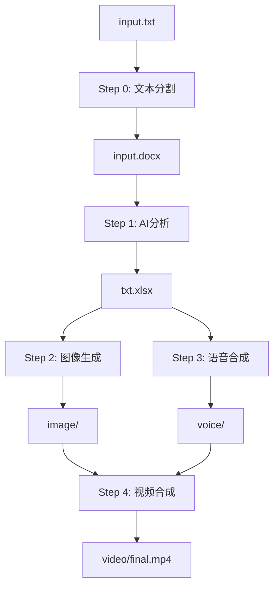

# 🛠️ 开发指南

## 🏗️ 项目架构

### 系统概览



### 核心模块

#### 1. 配置管理 (`config.py`)
```python
# 统一配置管理
from config import config

# 访问配置
llm_provider = config.llm_provider
api_key = config.openai_api_key
```

**主要功能**:
- 环境变量加载和验证
- 配置类型转换和默认值
- 路径管理和目录创建

#### 2. LLM客户端 (`llm_client.py`)
```python
# 统一LLM接口
from llm_client import llm_client

# 使用示例
translation = llm_client.translate_to_english(text)
storyboard = llm_client.translate_to_storyboard(text)
```

**设计特点**:
- 支持多服务商 (OpenAI, DeepSeek)
- 版本兼容性处理
- 重试机制和错误处理
- 统一接口抽象

#### 3. 业务模块

| 模块 | 功能 | 输入 | 输出 |
|------|------|------|------|
| `step0` | 文本分割 | `input.txt` | `input.docx` |
| `step1` | AI分析翻译 | `input.docx` | `txt.xlsx` |
| `step2` | 图像生成 | `txt.xlsx` | `image/*.png` |
| `step3` | 语音合成 | `txt.xlsx` | `voice/*.wav` |
| `step4` | 视频合成 | `image/`, `voice/` | `video/*.mp4` |

## 🔧 开发环境设置

### 开发工具推荐

```bash
# 代码格式化
pip install black isort

# 代码检查
pip install flake8 mypy

# 测试框架
pip install pytest pytest-cov
```

### 开发工作流

```bash
# 1. 激活开发环境
./activate_env.sh

# 2. 安装开发依赖
pip install -r requirements-dev.txt

# 3. 代码格式化
black .
isort .

# 4. 代码检查
flake8 .
mypy .

# 5. 运行测试
pytest tests/
```

## 📝 代码规范

### Python编码规范

1. **遵循PEP 8**
   - 使用4空格缩进
   - 行长度限制100字符
   - 函数和类命名使用snake_case和PascalCase

2. **文档字符串**
   ```python
   def translate_to_english(text: str) -> str:
       """将中文文本翻译为英文
       
       Args:
           text: 需要翻译的中文文本
           
       Returns:
           翻译后的英文文本
           
       Raises:
           APIError: 当API调用失败时
       """
   ```

3. **类型注解**
   ```python
   from typing import List, Dict, Optional
   
   def process_sentences(sentences: List[str]) -> Dict[str, str]:
       return {"result": "processed"}
   ```

### 错误处理

```python
try:
    result = api_call()
except requests.exceptions.RequestException as e:
    logger.error(f"API请求失败: {e}")
    raise APIError(f"服务暂时不可用: {e}")
except Exception as e:
    logger.exception("未知错误")
    raise
```

### 日志记录

```python
import logging

logger = logging.getLogger(__name__)

def process_text(text):
    logger.info(f"开始处理文本，长度: {len(text)}")
    try:
        result = do_processing(text)
        logger.info("文本处理完成")
        return result
    except Exception as e:
        logger.error(f"文本处理失败: {e}")
        raise
```

## 🔌 API集成

### LLM服务集成

#### 添加新的LLM提供商

1. **扩展配置**
   ```python
   # config.py
   @property
   def new_provider_api_key(self) -> str:
       return os.getenv('NEW_PROVIDER_API_KEY', '')
   ```

2. **扩展客户端**
   ```python
   # llm_client.py
   def _setup_client(self):
       if self.provider == 'new_provider':
           self.client = NewProviderClient(
               api_key=config.new_provider_api_key
           )
           self.model = config.new_provider_model
   ```

3. **添加环境变量**
   ```env
   # .env
   LLM_PROVIDER=new_provider
   NEW_PROVIDER_API_KEY=your_key
   NEW_PROVIDER_MODEL=new_model
   ```

### Stable Diffusion集成

#### API调用示例

```python
import requests

def generate_image(prompt: str, negative_prompt: str = "") -> bytes:
    payload = {
        "prompt": prompt,
        "negative_prompt": negative_prompt,
        "steps": config.sd_steps,
        "cfg_scale": config.sd_cfg_scale,
        "width": config.sd_width,
        "height": config.sd_height,
        "sampler_name": config.sd_sampler,
    }
    
    response = requests.post(
        f"{config.sd_api_url}/sdapi/v1/txt2img",
        json=payload,
        timeout=300
    )
    
    if response.status_code == 200:
        return base64.b64decode(response.json()["images"][0])
    else:
        raise APIError(f"图像生成失败: {response.text}")
```

### Azure TTS集成

```python
import azure.cognitiveservices.speech as speechsdk

def synthesize_speech(text: str, output_file: str):
    speech_config = speechsdk.SpeechConfig(
        subscription=config.azure_speech_key,
        region=config.azure_speech_region
    )
    
    speech_config.speech_synthesis_voice_name = config.azure_voice_name
    
    synthesizer = speechsdk.SpeechSynthesizer(
        speech_config=speech_config,
        audio_config=speechsdk.audio.AudioOutputConfig(filename=output_file)
    )
    
    result = synthesizer.speak_text_async(text).get()
    
    if result.reason == speechsdk.ResultReason.SynthesizingAudioCompleted:
        print(f"语音合成成功: {output_file}")
    else:
        raise APIError(f"语音合成失败: {result.reason}")
```

## 🧪 测试框架

### 单元测试

```python
# tests/test_config.py
import pytest
from config import Config

def test_config_loading():
    config = Config()
    assert config.llm_provider in ['openai', 'deepseek']
    assert config.project_root.exists()

def test_config_validation():
    config = Config()
    errors = config.validate_config()
    # 在测试环境中，某些API密钥可能未设置
    assert isinstance(errors, list)
```

### 集成测试

```python
# tests/test_llm_client.py
import pytest
from llm_client import llm_client

@pytest.mark.integration
def test_llm_translation():
    text = "测试文本"
    result = llm_client.translate_to_english(text)
    assert isinstance(result, str)
    assert len(result) > 0
```

### Mock测试

```python
# tests/test_step2.py
from unittest.mock import patch, MagicMock
import step2_txt_to_image

@patch('requests.post')
def test_image_generation(mock_post):
    mock_response = MagicMock()
    mock_response.status_code = 200
    mock_response.json.return_value = {"images": ["base64_image_data"]}
    mock_post.return_value = mock_response
    
    result = step2_txt_to_image.generate_image("test prompt")
    assert result is not None
    mock_post.assert_called_once()
```

## 📊 性能优化

### 并发处理

```python
from concurrent.futures import ThreadPoolExecutor, as_completed
from tqdm import tqdm

def process_sentences_parallel(sentences: List[str]) -> List[str]:
    max_workers = min(len(sentences), config.max_workers_translation)
    
    with ThreadPoolExecutor(max_workers=max_workers) as executor:
        futures = {
            executor.submit(llm_client.translate_to_english, sentence): idx 
            for idx, sentence in enumerate(sentences)
        }
        
        results = [None] * len(sentences)
        for future in tqdm(as_completed(futures), total=len(futures)):
            idx = futures[future]
            results[idx] = future.result()
            
    return results
```

### 缓存策略

```python
from functools import lru_cache
import hashlib

@lru_cache(maxsize=1000)
def cached_translation(text: str) -> str:
    """缓存翻译结果避免重复API调用"""
    return llm_client.translate_to_english(text)

def get_cache_key(text: str) -> str:
    """生成缓存键"""
    return hashlib.md5(text.encode()).hexdigest()
```

### 内存管理

```python
import gc
from PIL import Image

def process_large_dataset(items):
    for i, item in enumerate(items):
        result = process_item(item)
        
        # 定期清理内存
        if i % 100 == 0:
            gc.collect()
            
        yield result
```

## 🔍 调试技巧

### 日志配置

```python
# setup_logging.py
import logging
from config import config

def setup_logging():
    level = getattr(logging, config.log_level.upper())
    
    logging.basicConfig(
        level=level,
        format='%(asctime)s - %(name)s - %(levelname)s - %(message)s',
        handlers=[
            logging.FileHandler('app.log'),
            logging.StreamHandler()
        ]
    )
```

### 调试工具

```python
# 使用pdb调试
import pdb; pdb.set_trace()

# 使用ipdb增强调试
import ipdb; ipdb.set_trace()

# 性能分析
import cProfile
cProfile.run('main_function()')
```

### 环境变量调试

```bash
# 查看当前配置
python -c "from config import config; config.print_config_summary()"

# 测试特定功能
DEBUG=true python step1_extract_keywords-rolev1.1.py

# 详细日志
LOG_LEVEL=DEBUG python Auto.py
```

## 🚀 部署指南

### Docker部署

```dockerfile
# Dockerfile
FROM python:3.12-slim

WORKDIR /app
COPY requirements.txt .
RUN pip install -r requirements.txt

COPY . .
RUN python -m spacy download zh_core_web_sm

CMD ["python", "Auto.py"]
```

```yaml
# docker-compose.yml
version: '3.8'
services:
  txt-to-video:
    build: .
    environment:
      - LLM_PROVIDER=${LLM_PROVIDER}
      - DEEPSEEK_API_KEY=${DEEPSEEK_API_KEY}
      - AZURE_SPEECH_KEY=${AZURE_SPEECH_KEY}
    volumes:
      - ./input:/app/input
      - ./output:/app/video
```

### 生产环境配置

```bash
# 生产环境变量
export ENVIRONMENT=production
export DEBUG=false
export LOG_LEVEL=INFO

# 资源限制
export MAX_WORKERS_TRANSLATION=8
export MAX_WORKERS_IMAGE=2

# 超时设置
export API_TIMEOUT=300
export REQUEST_RETRY_TIMES=3
```

## 📈 监控和维护

### 健康检查

```python
# health_check.py
def check_system_health():
    checks = {
        "config": check_config(),
        "llm_service": check_llm_connection(),
        "azure_tts": check_azure_connection(),
        "stable_diffusion": check_sd_connection(),
        "disk_space": check_disk_space(),
    }
    
    all_healthy = all(checks.values())
    return {"healthy": all_healthy, "details": checks}
```

### 性能监控

```python
# metrics.py
import time
from functools import wraps

def timing_decorator(func):
    @wraps(func)
    def wrapper(*args, **kwargs):
        start_time = time.time()
        result = func(*args, **kwargs)
        duration = time.time() - start_time
        
        logger.info(f"{func.__name__} 执行时间: {duration:.2f}秒")
        return result
    return wrapper

@timing_decorator
def process_step(step_name, data):
    # 处理逻辑
    pass
```

### 错误报告

```python
# error_reporter.py
import traceback

def report_error(error: Exception, context: dict = None):
    error_info = {
        "error_type": type(error).__name__,
        "error_message": str(error),
        "traceback": traceback.format_exc(),
        "context": context or {},
        "timestamp": datetime.now().isoformat(),
    }
    
    logger.error(f"错误报告: {error_info}")
    # 可以发送到错误追踪服务
```

---

## 🤝 贡献指南

### 提交代码

1. **创建功能分支**
   ```bash
   git checkout -b feature/new-feature
   ```

2. **遵循提交规范**
   ```bash
   git commit -m "feat: 添加新的LLM提供商支持"
   git commit -m "fix: 修复图像生成超时问题"
   git commit -m "docs: 更新API文档"
   ```

3. **测试覆盖**
   ```bash
   pytest --cov=. --cov-report=html
   ```

4. **代码审查**
   - 确保代码符合规范
   - 添加必要的测试
   - 更新相关文档

### 功能开发流程

1. **需求分析** → 确定功能范围和API设计
2. **设计文档** → 编写技术设计文档
3. **编码实现** → 遵循代码规范开发
4. **测试验证** → 单元测试和集成测试
5. **文档更新** → 更新用户文档和API文档
6. **代码审查** → 同行评审和优化建议

---

**需要了解具体使用方法，请查看 [用户指南](user-guide.md)。想了解配置详情，请查看 [环境配置](environment-setup.md)。**
